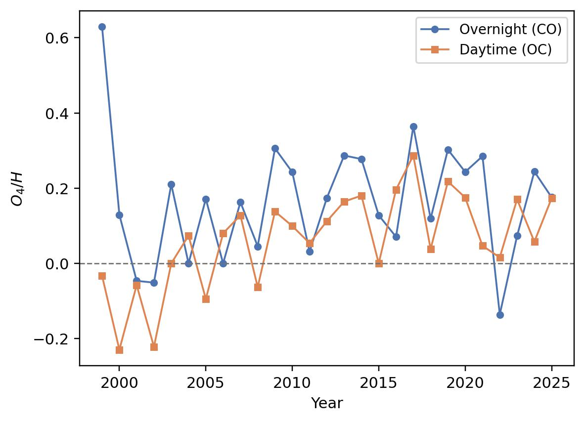
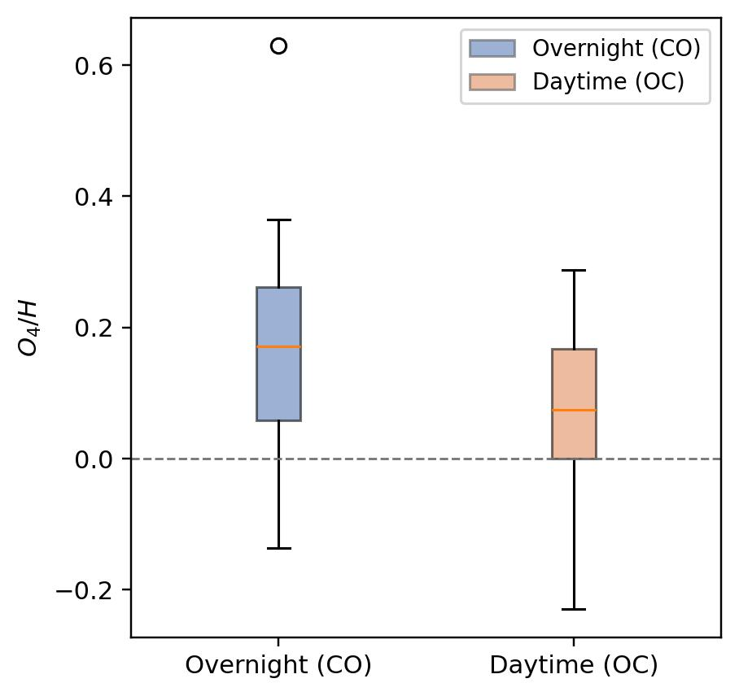
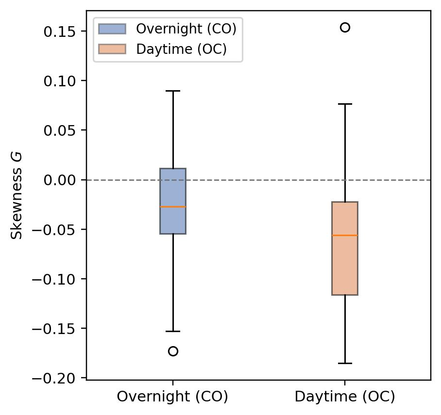
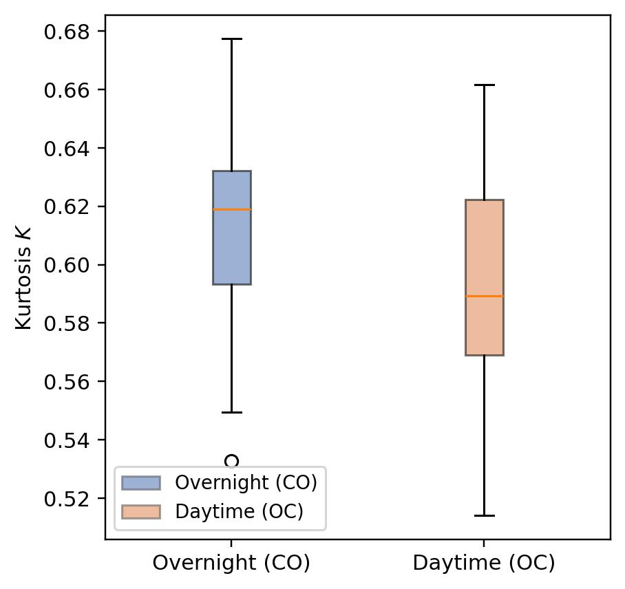
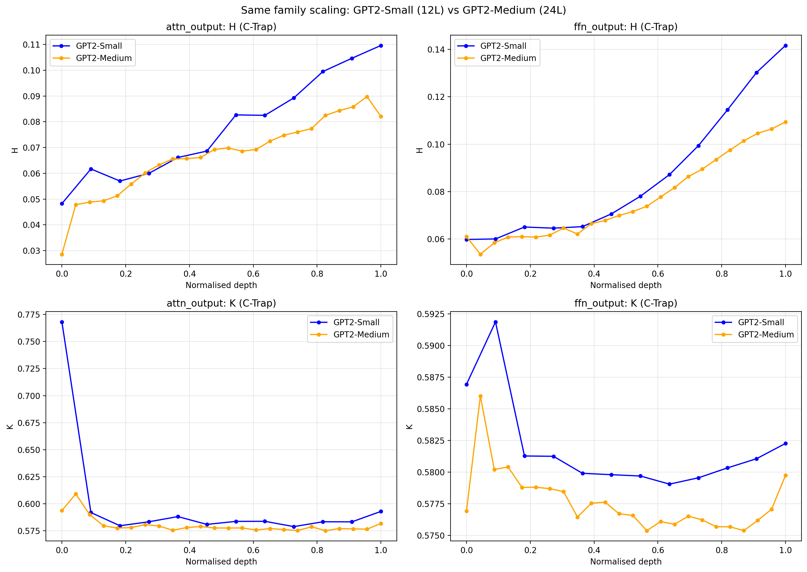
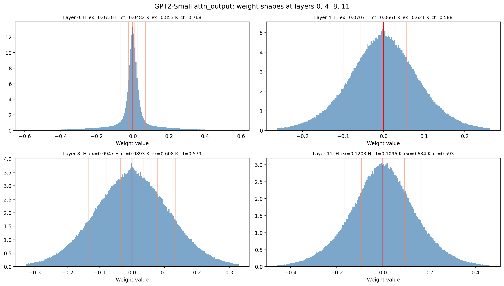

# Interpretation of Quantile Shape Metrics by Simple Quadrature Approximations

**Reproducibility package for the paper:**
> *Interpretation of Quantile Shape Metrics by Simple Quadrature Approximations*
> Triparna Kundu, Rashanjot Kaur, and Eugene Pinsky
> Department of Computer Science, Boston University

---

## Overview

This repository provides the complete computational reproducibility package for the paper. The paper establishes that many widely-used quantile-based shape metrics — spread (H), skewness (G), and kurtosis (K) — can be interpreted as **mean absolute deviations (MAD)** expressed as integrals of the quantile function. Simple quadrature rules applied to these integrals directly recover, and in some cases improve upon, standard octile/quartile formulas.

Two approximation families are studied and compared against exact computation:

| Method | Description | Accuracy |
|---|---|---|
| **Midpoint** | Rectangles centered at quartiles/octiles | Lower — simple baseline |
| **C-Trapezoid** | Endpoint-extrapolated trapezoid rule using the same octiles | Higher — main contribution |

The C-Trapezoid approximation uses only 7 octile values yet achieves substantially lower error than the midpoint rule, without any additional data collection cost.

**Core formulas (C-Trapezoid):**

$$H_{\text{ctrap}} = \frac{3a + 2b + 3c}{8}, \quad a = O_7 - O_1,\ b = O_6 - O_2,\ c = O_5 - O_3$$

$$K_{\text{ctrap}} = \frac{3a - 3b + c}{3a - 2b + 3c}$$

where $O_i = Q(i/8)$ are the octiles of the distribution.

---

## Repository Structure

```
c-trapezoid-quantile-metrics/
├── requirements.txt
├── case_study_llm/               # Case Study 2: LLM weight matrices
│   ├── nb1-ctrapezoid/           # C-Trapezoid + Midpoint computation
│   ├── nb2-exact/                # Exact (full-matrix) baseline
│   └── nb3-comparison/           # All-methods comparison + paper figures
└── case_study_stock/             # Case Study 1: XLK financial time series
    ├── jupiter_notebooks/        # Quadrature method notebooks
    └── [XLK figures]             # Generated outputs used in paper
```

---

## Case Study 1 — Financial Time Series (XLK ETF)

### Setup

We apply the proposed MAD-based shape metrics to the **Technology Select Sector SPDR Fund (XLK)** daily log returns from 1999–2025. Each trading day is split into two periods:

- **Overnight (CO):** close-to-open return
- **Daytime (OC):** open-to-close return

For each year, octiles are estimated from the ~250 daily returns and used to compute H (spread), G (skewness), K (kurtosis), and O₄/H (a normalized spread ratio) via the midpoint and C-Trapezoid approximations. Exact values serve as the reference.

### Key Findings

- Both approximations **systematically underestimate** the exact MAD for XLK returns, with the midpoint error consistently larger than C-Trapezoid.
- The **overnight (CO) period** shows higher MAD percentage errors than the daytime (OC) period, reflecting the heavier-tailed nature of overnight returns.
- H and O₄/H exhibit clear **temporal structure** across years, capturing market regime changes (e.g., the 2008 financial crisis, COVID-19 volatility in 2020).
- G and K track asymmetry and tail behavior over time, with kurtosis elevated in high-volatility years.

### Outputs

**MAD Percentage Error — C-Trapezoid vs Midpoint (by year)**

| Overnight (CO) | Daytime (OC) |
|:---:|:---:|
|  |  |

**Spread metric H and normalized ratio O₄/H over time**

| H — Line | O₄/H — Line |
|:---:|:---:|
|  |  |

| H — Boxplot | O₄/H — Boxplot |
|:---:|:---:|
|  |  |

**Skewness (G) and Kurtosis (K) over time**

| G — Line | K — Line |
|:---:|:---:|
|  |  |

| G — Boxplot | K — Boxplot |
|:---:|:---:|
|  |  |

### Notebooks

| Notebook | Purpose |
|---|---|
| `simple_h_approximation_comparisons_11_17_2025.ipynb` | Generates XLK figures: H, G, K, O₄/H line and boxplot series |
| `comparison_approximations.ipynb` | Compares approximation methods across distributions |
| `relative_errors.ipynb` | Relative error analysis across quadrature methods |
| `midpoint_quadrature.ipynb` | Midpoint rule illustration |
| `mu_area_*.ipynb` | Geometric interpretation of MAD as subarea integrals |
| `mad_sum_areas.ipynb`, `mad_diff_areas.ipynb` | MAD decomposition into sum/difference subareas |
| `uniform_exp_pareto_quantile_functions.ipynb` | Illustrative examples on standard distributions |

---

## Case Study 2 — LLM Weight Matrix Shape Analysis

### Setup

We apply the C-Trapezoid and Midpoint approximations to the **weight matrices of pre-trained large language models**, treating each weight matrix as an empirical distribution. Metrics are computed per layer and per weight type (attention input/output, FFN input/output).

Models evaluated:

| Model | Family | Parameters |
|---|---|---|
| GPT-2 Small | GPT | 117M |
| GPT-2 Medium | GPT | 345M |
| OPT-125M | OPT | 125M |
| Pythia-160M | Pythia | 160M |

For each weight matrix, three variants are computed:
- **Exact**: full sort of all matrix elements (reference baseline)
- **C-Trapezoid**: octile-based approximation
- **Midpoint**: octile midpoint approximation

### Key Findings

C-Trapezoid consistently and substantially outperforms the midpoint approximation across all models, layer types, and metrics:

| Model | H C-Trap Error | H Midpoint Error | K C-Trap Error | K Midpoint Error |
|---|---|---|---|---|
| GPT-2 Small | ~6–9% | ~18–24% | ~5–6% | ~5–8% |
| GPT-2 Medium | ~5–6% | ~16–19% | ~4–5% | ~4–6% |
| OPT-125M | ~6–7% | ~20–24% | ~5% | ~5–10% |
| Pythia-160M | ~5–21% | ~17–42% | ~4–10% | ~4–15% |

- **H (spread)**: C-Trapezoid error is 3–4× lower than Midpoint on average.
- **K (kurtosis)**: Both methods have moderate error, but C-Trapezoid is consistently closer to exact.
- **Depth patterns**: Metrics vary systematically with layer depth — H tends to decrease in later layers; K shows model-family-specific signatures.
- **Cross-family consistency**: The ranking of methods (Exact > C-Trapezoid > Midpoint) holds across all four model families tested.

### Outputs

**Three-method comparison on GPT-2 Small (H and K by layer)**


**Scatter: Exact vs C-Trapezoid and Midpoint across all models**

| H | K |
|:---:|:---:|
|  |  |

**Cross-model-family comparison**


**GPT-2 scaling comparison (Small vs Medium)**



**Distribution of weight matrices by depth (histograms)**


**H and K vs layer depth (C-Trapezoid)**

| H vs depth | K vs depth |
|:---:|:---:|
|  |  |

**Boxplots across all weight types**



### Notebooks

| Notebook | Purpose |
|---|---|
| `nb1-ctrapezoid/nb1_ctrapezoid.ipynb` | Computes C-Trapezoid and Midpoint metrics for all models; writes `all_ctrap.csv`, `summary_ctrap.csv`, and per-layer figures |
| `nb2-exact/nb2_exact.ipynb` | Computes exact metrics (full sort); writes `all_exact.csv`, `summary_exact.csv` |
| `nb3-comparison/nb3_comparison.ipynb` | Loads outputs from nb1 and nb2; produces all comparison figures and `error_summary.csv` |

### Data files (pre-computed, included in repo)

| File | Contents |
|---|---|
| `nb1-ctrapezoid/all_ctrap.csv` | Per-layer C-Trapezoid and Midpoint metrics for all models |
| `nb1-ctrapezoid/summary_ctrap.csv` | Per-model summary statistics |
| `nb2-exact/all_exact.csv` | Per-layer exact metrics for all models |
| `nb2-exact/summary_exact.csv` | Per-model exact summary statistics |
| `nb3-comparison/all_compare.csv` | Merged exact + approximation results |
| `nb3-comparison/error_summary.csv` | Percentage errors by model and weight type |
| `nb3-comparison/gpt2_small_comparison.csv` | Layer-by-layer comparison for GPT-2 Small |

---

## Reproducing the Results

```bash
python -m venv .venv
source .venv/bin/activate      # Windows: .venv\Scripts\activate
pip install -r requirements.txt
jupyter lab
```

**For Case Study 2 (LLM)**, run notebooks in order: `nb1` → `nb2` → `nb3`. Model weights are downloaded automatically from Hugging Face on first run.

**For Case Study 1 (Stock)**, open any notebook in `case_study_stock/jupiter_notebooks/`. The XLK data is loaded within the notebooks.

---
<!-- 
## Citation

If you use this code or the methods described in the paper, please cite:

```
@article{kundu2026quantile,
  title={Interpretation of Quantile Shape Metrics by Simple Quadrature Approximations},
  author={Kundu, Triparna and Kaur, Rashanjot and Pinsky, Eugene},
  journal={},
  year={2026}
}
``` -->
