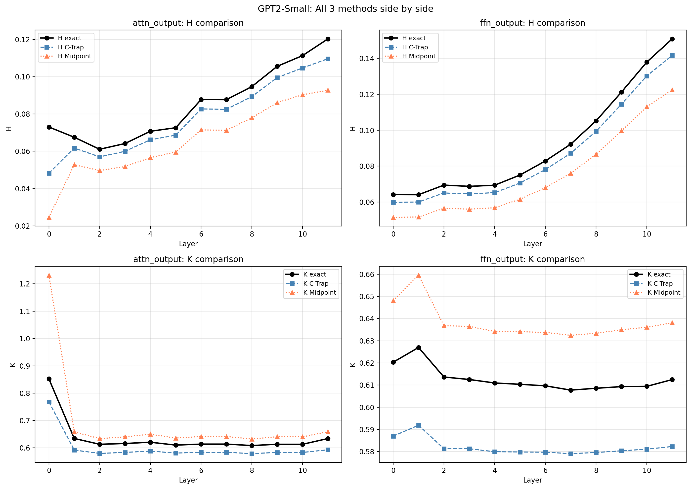
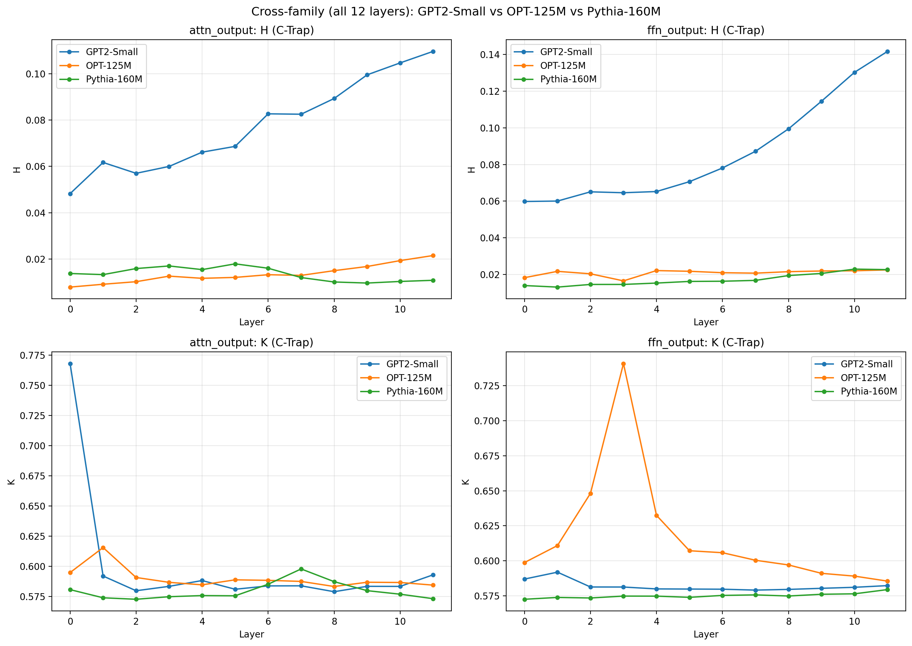
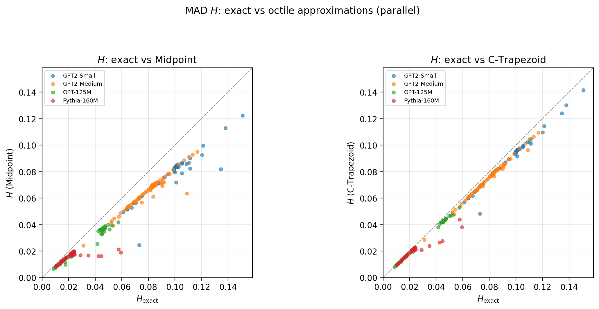

# Elementary and Robust Distribution Shape Analysis via Mean Absolute Deviations and Quantile-Based Quadrature Approximations

**Reproducibility package for:**
> Pinsky, E., Kundu, T., and Kaur, R.  
> *Elementary and Robust Distribution Shape Analysis via Mean Absolute Deviations and Quantile-Based Quadrature Approximations*  
> Journal of Experimental and Theoretical Analyses (JETA), 2026.

---

## Overview

This repository provides the complete computational reproducibility package for the paper. The paper derives a general class of MAD-based shape metrics — spread (H), skewness (G), and kurtosis (K) — as integrals of the quantile function, and proposes a C-Trapezoid quadrature approximation that achieves substantially lower error than the standard midpoint rule using only seven octile values.

**Core C-Trapezoid formulas:**

$$I_L = \frac{3O_1 - 2O_2 + 3O_3}{8}, \quad I_R = \frac{3O_5 - 2O_6 + 3O_7}{8}$$

$$H = I_R - I_L, \quad G = \frac{(I_L + I_R) - O_4}{H}, \quad K = \frac{3(O_7-O_1) - 3(O_6-O_2) + (O_5-O_3)}{3(O_7-O_1) - 2(O_6-O_2) + 3(O_5-O_3)}$$

where $O_i = Q(i/8)$ are the octile values of the distribution.

---

## Repository Structure

```
c-trapezoid-quantile-metrics/
├── README.md
├── requirements.txt
├── comparison_approximations.ipynb    # Illustrative quadrature comparisons
├── jupiter_notebooks/
│   └── scripts/                       # Standalone replication scripts
│       ├── wall_clock_mle_vs_closed_form.py   # Table 9: timing benchmark
│       ├── wall_clock_mle_vs_closed_form.csv  # Pre-computed timing results
│       ├── llm_dataset_summary.py             # Table 26: LLM dataset statistics
│       ├── llm_dataset_summary.csv            # Pre-computed dataset summary
│       ├── llm_weight_acf.py                  # Table 27: raw weight ACF
│       └── llm_weight_acf.csv                 # Pre-computed ACF results
├── case_study_llm/                    # Case Study II: LLM weight distributions
│   ├── nb1-ctrapezoid/                # C-Trapezoid + Midpoint computation
│   ├── nb2-exact/                     # Exact (full-sort) baseline
│   └── nb3-comparison/                # All-methods comparison + paper figures
└── case_study_stock/                  # Case Study I: XLK ETF returns
    ├── jupiter_notebooks/             # Quadrature analysis notebooks
    └── [figures]                      # Generated outputs used in paper
```

---

## Quick Start

```bash
git clone https://github.com/anacodicAI-labs/c-trapezoid-quantile-metrics.git
cd c-trapezoid-quantile-metrics
pip install -r requirements.txt
```

---

## Standalone Scripts (`jupiter_notebooks/scripts/`)

Each script is self-contained and writes its outputs to the current directory.

### `wall_clock_mle_vs_closed_form.py` — Table 9

Compares median wall-clock time (milliseconds) between:
- **MLE**: `scipy.stats.weibull_min.fit` (iterative optimizer)
- **Closed-form**: PWM / L-moment inversion (non-iterative, rank-based)

for Weibull(α=2, β=1) across sample sizes n = 100 to 5000.

```bash
cd jupiter_notebooks/scripts
python wall_clock_mle_vs_closed_form.py
```

Pre-computed results are in `wall_clock_mle_vs_closed_form.csv`.  
**Note:** Timings are machine-specific — re-run on your hardware for reproducible values.

| n | MLE (ms) | Closed-form (ms) | Speedup |
|---|---|---|---|
| 100 | ~5.3 | ~0.09 | ~58× |
| 1000 | ~6.6 | ~0.96 | ~7× |
| 5000 | ~12.1 | ~3.9 | ~3× |

---

### `llm_dataset_summary.py` — Table 26

Computes primary dataset information and marginal statistics for all four LLM weight-matrix roles across all four models. Downloads model checkpoints from Hugging Face on first run (~2 GB total, cached afterwards).

```bash
cd jupiter_notebooks/scripts
python llm_dataset_summary.py
# writes llm_dataset_summary.csv
```

Pre-computed results are in `llm_dataset_summary.csv`.

---

### `llm_weight_acf.py` — Table 27

Computes mean Pearson autocorrelation of raw weight values at lags 1–5. For each model, role, and layer the weight matrix is flattened into a 1D vector; ACF is computed and averaged across layers.

```bash
cd jupiter_notebooks/scripts
python llm_weight_acf.py
# writes llm_weight_acf.csv
```

Pre-computed results are in `llm_weight_acf.csv`.  
All values are within ±0.03 of zero (weights are approximately i.i.d. within each matrix), with the exception of `ffn_input` for GPT-2 Small (~+0.022) and GPT-2 Medium (~+0.026).

---

## Case Study I — XLK ETF Returns (1999–2025)

MAD-based shape metrics (H, G, K) applied to overnight and daytime returns of the XLK Technology ETF. For each year, octiles are estimated from ~250 daily returns and used to compute exact and approximate metrics.

### Key Findings
- C-Trapezoid errors are 2–3× lower than midpoint errors for H
- Overnight returns show higher spread and more pronounced kurtosis than daytime
- H and K track market regime changes (2008 financial crisis, COVID-19 volatility)

### Notebooks (`case_study_stock/jupiter_notebooks/`)

| Notebook | Purpose |
|---|---|
| `simple_h_approximation_comparisons_11_17_2025.ipynb` | Main XLK analysis: H, G, K, O₄/H line and boxplot series |
| `comparison_approximations.ipynb` | Compares approximation methods across distributions |
| `relative_errors.ipynb` | Relative error analysis |
| `mu_area_*.ipynb` | Geometric interpretation of MAD as subarea integrals |
| `mad_sum_areas.ipynb`, `mad_diff_areas.ipynb` | MAD decomposition |

### Figures

| | |
|:---:|:---:|
|  |  |
| H spread — line (overnight) | H spread — boxplot |
|  |  |
| Skewness G over time | Kurtosis K over time |

---

## Case Study II — LLM Weight Matrix Shape Analysis

C-Trapezoid and Midpoint approximations applied to weight matrices of four pre-trained language models, treating each weight matrix as an empirical distribution.

**Models:**

| Model | Family | Parameters | Layers |
|---|---|---|---|
| GPT-2 Small | GPT-2 | 117M | 12 |
| GPT-2 Medium | GPT-2 | 345M | 24 |
| OPT-125M | OPT | 125M | 12 |
| Pythia-160M | Pythia | 160M | 12 |

### Key Findings
- C-Trapezoid consistently outperforms Midpoint: H errors 3–4× lower on average
- All weight distributions are leptokurtic (classical excess kurtosis > 0)
- `ffn_output` spread grows monotonically with layer depth across all models
- Raw weight values are approximately uncorrelated within each matrix (ACF ≈ 0)

### Notebooks (`case_study_llm/`)

| Notebook | Purpose |
|---|---|
| `nb1-ctrapezoid/nb1_ctrapezoid.ipynb` | C-Trapezoid + Midpoint metrics; writes `all_ctrap.csv` and figures |
| `nb2-exact/nb2_exact.ipynb` | Exact (full-sort) metrics; writes `all_exact.csv` |
| `nb3-comparison/nb3_comparison.ipynb` | Loads nb1+nb2 outputs; produces all comparison figures and `error_summary.csv` |

Run in order: `nb1` → `nb2` → `nb3`.

### Pre-computed Data Files

| File | Contents |
|---|---|
| `nb1-ctrapezoid/all_ctrap.csv` | Per-layer C-Trapezoid and Midpoint H, G, K for all models |
| `nb1-ctrapezoid/summary_ctrap.csv` | Per-model summary statistics |
| `nb2-exact/all_exact.csv` | Per-layer exact H, G, K for all models |
| `nb2-exact/summary_exact.csv` | Per-model exact summary |
| `nb3-comparison/all_compare.csv` | Merged exact + approximation results |
| `nb3-comparison/error_summary.csv` | Percentage errors by model and weight type |
| `nb3-comparison/gpt2_small_comparison.csv` | Layer-by-layer comparison for GPT-2 Small |
| `scripts/llm_dataset_summary.csv` | Marginal statistics for all 16 model×role combinations |
| `scripts/llm_weight_acf.csv` | Raw weight ACF at lags 1–5 for all model×role combinations |

### Figures

| | |
|:---:|:---:|
|  |  |
| GPT-2 Small: 3-method comparison | Cross-model-family comparison |
|  |  |
| Scatter: Exact vs C-Trap/Midpoint (H) | Scatter: Exact vs C-Trap/Midpoint (K) |

---

## Requirements

```
numpy>=1.24
scipy>=1.10
pandas>=2.0
matplotlib>=3.7
jupyter>=1.0
transformers>=4.35    # for LLM case study
torch>=2.0            # for LLM case study
```

Install with:
```bash
pip install -r requirements.txt
```

---

## Citation

```bibtex
@article{pinsky2026mad,
  title   = {Elementary and Robust Distribution Shape Analysis via Mean Absolute Deviations
             and Quantile-Based Quadrature Approximations},
  author  = {Pinsky, Eugene and Kundu, Triparna and Kaur, Rashanjot},
  journal = {Journal of Experimental and Theoretical Analyses},
  year    = {2026}
}
```
