# MAD-Based Quantile Shape Analysis with C-Trapezoid Quadrature

**Reproducibility repository for the accepted paper:**

> Pinsky, E., Kundu, T., and Kaur, R.
> *Elementary and Robust Distribution Shape Analysis via Mean Absolute Deviations
> and Quantile-Based Quadrature Approximations*
> **Journal of Experimental and Theoretical Analyses (JETA), 2026.**

---

## What This Paper Does

Standard distributional shape metrics — variance, skewness, kurtosis — are built on moments that break down for heavy-tailed distributions and amplify the influence of outliers. This paper establishes that the same shape information is encoded, more robustly and with direct geometric meaning, in two signed areas beneath the quantile function $Q(p)$:

$$I_L = \int_0^{1/2} Q(p)\,dp, \qquad I_R = \int_{1/2}^{1} Q(p)\,dp.$$

From these two integrals, three shape metrics follow immediately:

| Metric | Formula | Interpretation |
|---|---|---|
| **Spread** $H$ | $I_R - I_L$ | Median absolute deviation around the median |
| **Skewness** $G$ | $\dfrac{(I_L+I_R) - Q(1/2)}{H}$ | Asymmetry of the quantile curve; $G \in (-1,1)$, $G=0$ iff symmetric |
| **Kurtosis** $K$ | $\dfrac{H_L + H_R}{H}$ | Ratio of inner-half to outer-half spread; $K = 0.5$ for Uniform |

where $H_L, H_R$ are the half-range analogs of $H$ over $[0,\tfrac{1}{4}]$–$[\tfrac{1}{4},\tfrac{1}{2}]$ and $[\tfrac{1}{2},\tfrac{3}{4}]$–$[\tfrac{3}{4},1]$ respectively.

### The C-Trapezoid Approximation

Evaluating $I_L$ and $I_R$ exactly requires sorting or numerical integration. The paper proposes a closed-form **C-Trapezoid rule** using only the seven octile values $O_i = Q(i/8)$:

$$I_L^{\text{ctrap}} = \frac{3O_1 - 2O_2 + 3O_3}{8}, \qquad I_R^{\text{ctrap}} = \frac{3O_5 - 2O_6 + 3O_7}{8}.$$

This is derived via cubic endpoint extrapolation: the rule infers values beyond $O_1$ and $O_7$ from the local curvature of the quantile function, correcting the systematic underestimation of the standard midpoint rule ($I_L \approx O_2/2$).

**Accuracy across benchmark distributions (population octiles):**

| Distribution | Midpoint $H$ error | **C-Trapezoid $H$ error** |
|---|---|---|
| Uniform | 0.00% | **0.00%** |
| Exponential | −20.75% | **−6.71%** |
| Normal | −15.47% | **−4.18%** |
| Log-Normal | −35.43% | **−15.98%** |
| Laplace | −30.69% | **−9.11%** |
| Pareto ($\alpha=2$) | −48.98% | **−29.21%** |
| Weibull (shape=2) | −13.37% | **−3.31%** |

C-Trapezoid reduces absolute error by **3–5×** using the same seven octile values, with no iterative computation.

### Closed-Form Parameter Estimation

Inverting the C-Trapezoid approximations for $H$ and $\mu = I_L + I_R$ yields analytic parameter estimators for standard families, avoiding iterative MLE entirely:

| Distribution | Estimator |
|---|---|
| Normal | $\hat{\mu} = I_L + I_R$, $\hat{\sigma} = \sqrt{2}\,\Phi^{-1}(3/4)\cdot H / (O_6 - O_2)$ |
| Weibull | Closed-form inversion via $H$ and $\mu$ (paper Appendix B) |
| Exponential | $\hat{\lambda} = 1/\mu$ |
| Log-Normal | $\hat{\mu}_{\log} = \log(I_L + I_R) - \tfrac{1}{2}\hat{\sigma}_{\log}^2$ |

For Weibull, the closed-form estimator is **3–58× faster** than MLE depending on sample size (see Table 9 and `wall_clock_mle_vs_closed_form.py`).

---

## Repository Structure

```
c-trapezoid-quantile-metrics/
│
├── README.md
├── requirements.txt
├── comparison_approximations.ipynb
├── simple_h_approximation_comparisons_11_17_2025_laplace_fixed.ipynb
│
├── jupiter_notebooks/
│   └── scripts/                          ← Standalone replication scripts
│       ├── wall_clock_mle_vs_closed_form.py   ← Table 9: timing benchmark
│       ├── wall_clock_mle_vs_closed_form.csv  ← Pre-computed timing results
│       ├── llm_dataset_summary.py             ← Table 26: LLM dataset statistics
│       ├── llm_dataset_summary.csv            ← Pre-computed dataset summary
│       ├── llm_weight_acf.py                  ← Table 27: raw weight ACF
│       └── llm_weight_acf.csv                 ← Pre-computed ACF results
│
├── figures/                              ← Mathematical explanation figures (Figs. 1–3, 11)
│   ├── ON_DAY_returns.jpg                ← Fig. 4: Return period structure
│   ├── mu_area.jpg / mu_area_*.jpg       ← Fig. 1: MAD as subarea integral
│   ├── midpoint_quadrature.jpg           ← Fig. 2: Midpoint rule diagram
│   ├── rectangles_quadrature.jpg         ← Fig. 2: Rectangle rule diagram
│   ├── mad_sum_areas.jpg                 ← Fig. 3: MAD sum decomposition
│   ├── mad_diff_area.jpg                 ← Fig. 3: MAD difference decomposition
│   └── output.png                        ← Fig. 11: Transformer schematic
│
├── figures_llm/                          ← All LLM case study figures (Figs. 12–20)
│   ├── llm_fig1_histograms.png           ← Fig. 12: Weight histograms by layer
│   ├── llm_fig2_H_vs_depth.png           ← Fig. 16: H spread vs. depth, all models
│   ├── llm_fig3_K_vs_depth.png           ← Fig. 17: K kurtosis vs. depth
│   ├── llm_fig4_gpt2_three_methods.png   ← Fig. 15: Exact / C-Trap / Midpoint overlay
│   ├── llm_fig5_gpt2_scaling.png         ← Fig. 19: GPT-2 Small vs. Medium scaling
│   ├── llm_fig6_cross_family.png         ← Fig. 20: Cross-family comparison
│   ├── llm_fig7_boxplots.png             ← Fig. 18: H, G, K boxplots across roles
│   ├── llm_fig_scatter_H_parallel.png    ← Fig. 13: Exact vs. approx scatter (H)
│   └── llm_fig_scatter_K_parallel.png    ← Fig. 14: Exact vs. approx scatter (K)
│
├── case_study_llm/
│   ├── nb1-ctrapezoid/
│   │   ├── nb1_ctrapezoid.ipynb          ← C-Trap + Midpoint metrics per layer
│   │   ├── all_ctrap.csv                 ← Per-layer H, G, K (all models)
│   │   └── summary_ctrap.csv
│   ├── nb2-exact/
│   │   ├── nb2_exact.ipynb               ← Exact (full-sort) metrics
│   │   ├── all_exact.csv
│   │   └── summary_exact.csv
│   └── nb3-comparison/
│       ├── nb3_comparison.ipynb          ← Merges nb1+nb2; produces all paper figures
│       ├── all_compare.csv
│       ├── error_summary.csv
│       └── gpt2_small_comparison.csv
│
└── case_study_stock/
    ├── XLK_MAD_pct_err_CO.jpg           ← Fig. 5: Quadrature errors, overnight
    ├── XLK_MAD_pct_err_OC.jpg           ← Fig. 5: Quadrature errors, daytime
    ├── XLK_line_H.jpg                   ← Fig. 6: H spread time series
    ├── XLK_boxplot_H.jpg                ← Fig. 7: H spread boxplots
    ├── XLK_line_G.jpg                   ← Fig. 8: G skewness time series
    ├── XLK_boxplot_G.jpg                ← Fig. 9: G skewness boxplots
    ├── XLK_line_K.jpg                   ← Fig. 8: K kurtosis time series
    ├── XLK_boxplot_K.jpg                ← Fig. 9: K kurtosis boxplots
    ├── XLK_line_O4H.jpg                 ← Fig. 6: O4/H normalized median
    ├── XLK_boxplot_O4H.jpg              ← Fig. 7: O4/H boxplots
    └── jupiter_notebooks/               ← All XLK analysis notebooks
        ├── simple_h_approximation_comparisons_11_17_2025.ipynb  ← Main XLK analysis
        ├── etf_daynight_quadrature_accuracy.ipynb
        ├── comparison_approximations.ipynb
        ├── relative_errors.ipynb
        ├── mu_area_all_octiles.ipynb
        ├── mu_area_four_octiles.ipynb
        ├── mu_area_no_quadrature.ipynb
        ├── mu_area_two_quartiles.ipynb
        ├── all_quartiles.ipynb
        ├── midpoint_quadrature.ipynb
        ├── rectangles_quadrature.ipynb
        ├── mad_sum_areas.ipynb
        ├── mad_diff_areas.ipynb
        ├── exponential_example_computations.ipynb
        └── uniform_exp_pareto_quantile_functions.ipynb
```

---

## Replication Scripts

All three scripts in `jupiter_notebooks/scripts/` are fully self-contained. **Pre-computed CSV files are included** so results can be inspected immediately without downloading model weights or re-running computations.

---

### `wall_clock_mle_vs_closed_form.py` — Paper Table 9

**Purpose:** Benchmarks the median wall-clock time (milliseconds) of two Weibull parameter estimation approaches:
- **(A) MLE:** `scipy.stats.weibull_min.fit` with `floc=0` (iterative optimizer)
- **(B) Closed-form:** PWM/L-moment inversion (non-iterative, rank-based)

**Settings:** Weibull($\alpha=2$, $\beta=1$), $N_\text{trials}=30$, `seed=0`

**Run:**
```bash
cd jupiter_notebooks/scripts
python wall_clock_mle_vs_closed_form.py
```

**Reference output:**

| $n$ | MLE (ms) | Closed-form (ms) | % Time Saved |
|---|---|---|---|
| 100 | 1.66 | 0.038 | **97.7%** |
| 1,000 | 2.25 | 0.361 | **83.9%** |
| 10,000 | 10.54 | 3.62 | **65.6%** |
| 100,000 | 99.54 | 36.85 | **63.0%** |

> **Note:** Timings are machine-specific. Re-run on your hardware for reproducible results.
> The pre-computed CSV was generated on Linux x86_64, Python 3.12.

**Direct link:**
[`wall_clock_mle_vs_closed_form.py`](https://github.com/anacodicAI-labs/c-trapezoid-quantile-metrics/blob/main/jupiter_notebooks/scripts/wall_clock_mle_vs_closed_form.py) |
[`wall_clock_mle_vs_closed_form.csv`](https://github.com/anacodicAI-labs/c-trapezoid-quantile-metrics/blob/main/jupiter_notebooks/scripts/wall_clock_mle_vs_closed_form.csv)

---

### `llm_dataset_summary.py` — Paper Table 26

**Purpose:** For each of the four pre-trained language models and each of the four canonical weight-matrix roles (`attn_input`, `attn_output`, `ffn_input`, `ffn_output`), computes:
- Total scalar entries $n$ (architecture-exact)
- Observed range $[\min, \max]$
- Non-finite entry count (data integrity check; zero for all checkpoints)
- Pooled mean, standard deviation, classical skewness $G_c$, classical excess kurtosis $K_c^{\text{ex}}$

**Models** (~2 GB total, downloaded automatically from Hugging Face and cached on first run):

| Model | Hugging Face ID | Layers | `attn_input` $n$ | `ffn_input` $n$ |
|---|---|---|---|---|
| GPT-2 Small | `gpt2` | 12 | 21.23M | 28.31M |
| GPT-2 Medium | `gpt2-medium` | 24 | 75.50M | 100.66M |
| OPT-125M | `facebook/opt-125m` | 12 | 21.23M | 28.31M |
| Pythia-160M | `EleutherAI/pythia-160m` | 12 | 21.23M | 28.31M |

**Run:**
```bash
python llm_dataset_summary.py   # writes llm_dataset_summary.csv
```

**Selected results from pre-computed CSV:**
- All means within $10^{-3}$ of zero (near-zero-mean initialisation across all architectures)
- All 16 model×role combinations are leptokurtic ($K_c^{\text{ex}} > 0$)
- GPT-2 Small `attn_output`: $K_c^{\text{ex}} = +94.9$; GPT-2 Medium `attn_output`: $K_c^{\text{ex}} = +101.6$
- GPT-2 weight ranges far wider than OPT/Pythia: e.g. `attn_output` $[-8.88, +8.70]$ vs. $[-0.39, +0.37]$

---

### `llm_weight_acf.py` — Paper Table 27

**Purpose:** For each model, role, and layer: flattens the weight matrix into a 1D vector, computes Pearson autocorrelation at lags 1–5, averages across layers. Directly addresses the standard reproducibility requirement for "correlation statistics" of the datasets.

**Run:**
```bash
python llm_weight_acf.py   # writes llm_weight_acf.csv
```

**Selected results from pre-computed CSV:**
- All values within $\pm 0.03$ of zero: weight values are approximately uncorrelated within each matrix, consistent with near-i.i.d. initialization and gradient-based training
- Notable exception: `ffn_input` in GPT-2 Small ($\approx +0.022$) and Medium ($\approx +0.026$) shows mild, uniform positive ACF across all lags — suggesting mild row-wise structure in the feed-forward input projection weights

---

## Case Study I — XLK ETF Return Analysis (1999–2025)

**Dataset:** Technology Select Sector SPDR Fund (XLK) daily returns, split into:
- **Overnight (CO):** close-to-open return
- **Daytime (OC):** open-to-close return

Approximately 250 trading-day observations per year, daily resolution, zero missing values after standard filtering.

**Method:** For each calendar year, compute empirical octiles from ~250 returns; apply exact, midpoint, and C-Trapezoid approximations to obtain $H$, $G$, $K$, and the normalized metric $O_4/H$.

**Main notebook:** `case_study_stock/jupiter_notebooks/simple_h_approximation_comparisons_11_17_2025.ipynb`

### Key Findings

- C-Trapezoid $H$ error is **2–3× lower** than Midpoint across all years and sessions
- Overnight returns exhibit higher spread ($H$), heavier tails ($K$), and more volatile skewness ($G$) than daytime returns
- $H$ and $K$ spike sharply in **2008** (financial crisis) and **2020** (COVID-19 volatility), validating sensitivity to market stress regimes
- $G$ captures asymmetry shifts: overnight returns trend negative in bear markets, positive in bull markets

### Figures

| | |
|:---:|:---:|
| 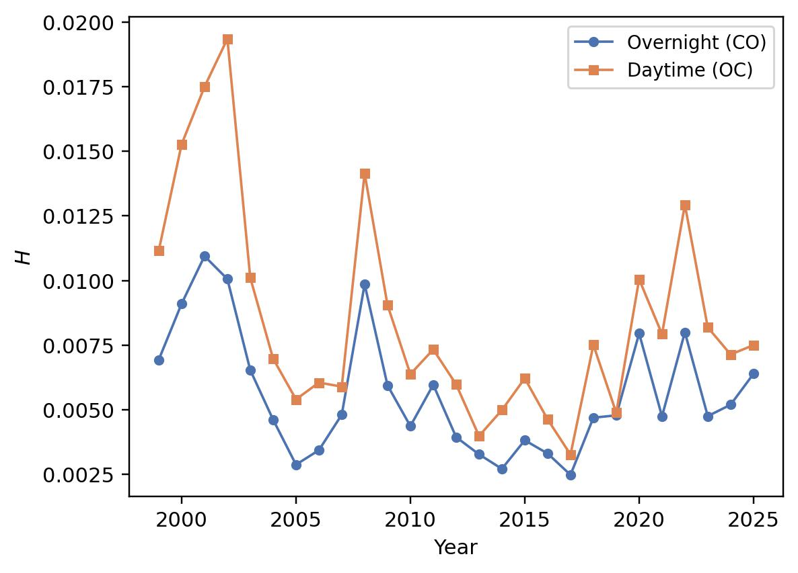 | 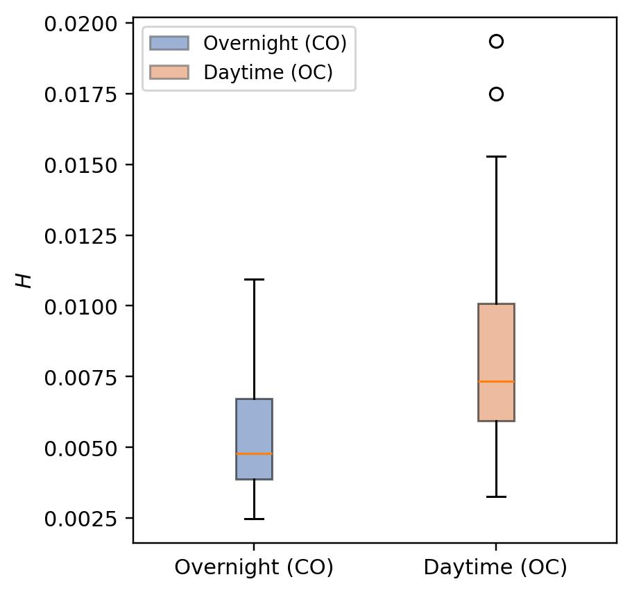 |
| MAD spread $H$ over time (1999–2025) | $H$ boxplots — overnight vs. daytime |
| 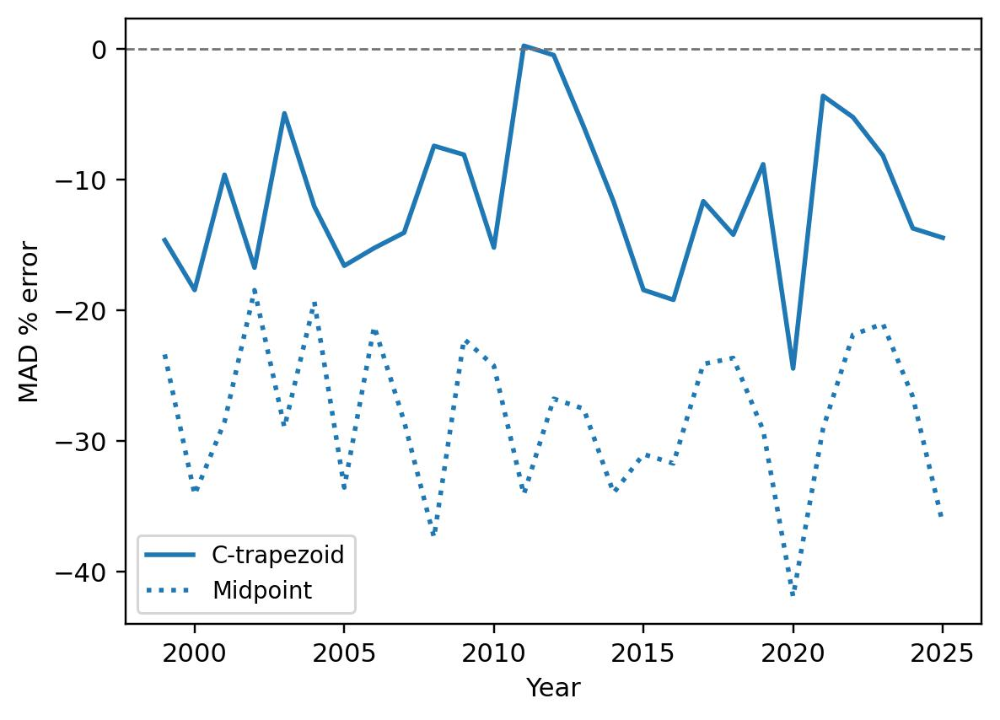 | 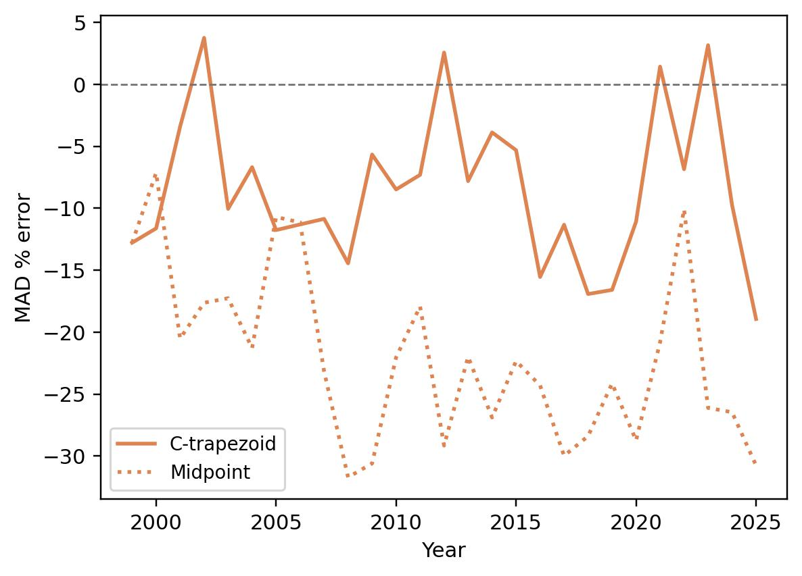 |
| Quadrature errors — overnight (CO) | Quadrature errors — daytime (OC) |
| 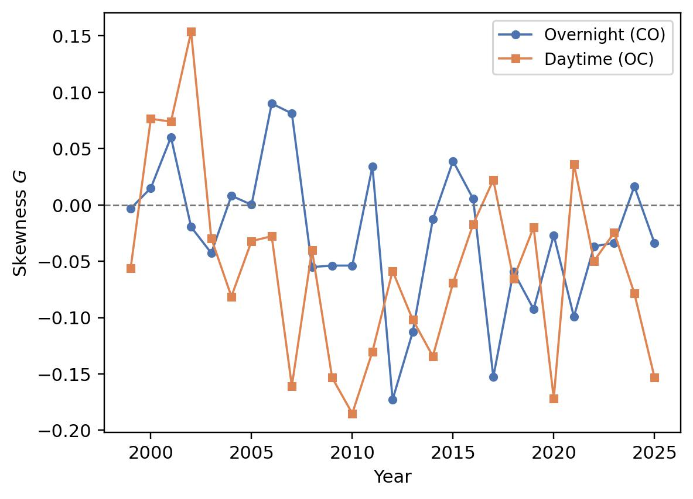 | 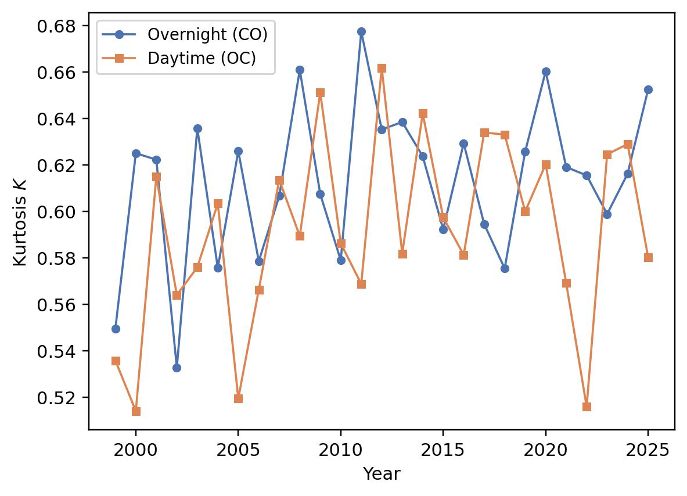 |
| Skewness $G$ over time | Kurtosis $K$ over time |

---

## Case Study II — Transformer Language Model Weight Analysis

**Dataset:** Pre-trained weight matrices from four transformer language models, downloaded from Hugging Face Hub (~2 GB total). Each weight matrix is treated as an empirical distribution; $H$, $G$, $K$ are computed per layer using three methods: exact (full sort), C-Trapezoid, Midpoint.

**Models:**

| Model | Hugging Face ID | Parameters | Layers | $d_{\text{model}}$ |
|---|---|---|---|---|
| GPT-2 Small | `gpt2` | 117M | 12 | 768 |
| GPT-2 Medium | `gpt2-medium` | 345M | 24 | 1024 |
| OPT-125M | `facebook/opt-125m` | 125M | 12 | 768 |
| Pythia-160M | `EleutherAI/pythia-160m` | 160M | 12 | 768 |

**Weight-matrix roles per layer:**

| Role | Weights | Size (GPT-2 Small) |
|---|---|---|
| `attn_input` | Combined Q/K/V projection | 768 × 2304 |
| `attn_output` | Attention output projection | 768 × 768 |
| `ffn_input` | Feed-forward layer 1 (expansion) | 768 × 3072 |
| `ffn_output` | Feed-forward layer 2 (contraction) | 3072 × 768 |

**Notebook pipeline** — run in order:

| Step | Notebook | Writes |
|---|---|---|
| 1 | `nb1-ctrapezoid/nb1_ctrapezoid.ipynb` | `all_ctrap.csv`, `summary_ctrap.csv`, per-layer figures |
| 2 | `nb2-exact/nb2_exact.ipynb` | `all_exact.csv`, `summary_exact.csv` |
| 3 | `nb3-comparison/nb3_comparison.ipynb` | All paper figures, `error_summary.csv` |

### Key Findings

- **C-Trapezoid $H$ error is 3–4× lower** than Midpoint across all models, roles, and layers
- **Depth trends:** `ffn_output` $H$ grows monotonically with layer depth in all models (layer-series ACF: +0.74 for GPT-2 Small, +0.89 for GPT-2 Medium); `attn_input` and `ffn_input` stabilize quickly after layer 0
- **All weight distributions are leptokurtic** ($K_c^{\text{ex}} > 0$); GPT-2 `attn_output` and `ffn_output` show extreme tail heaviness ($K_c^{\text{ex}} \approx 95$ and $76$)
- **Raw weight entries are approximately uncorrelated** within each matrix (ACF $\approx 0$ at all lags 1–5), consistent with near-i.i.d. initialization

### Approximation Error Summary

| Model | $H$ C-Trap err | $H$ Midpoint err | $K$ C-Trap err | $K$ Midpoint err |
|---|---|---|---|---|
| GPT-2 Small | 6–9% | 18–24% | 5–6% | 5–8% |
| GPT-2 Medium | 5–6% | 16–19% | 4–5% | 4–6% |
| OPT-125M | 6–7% | 20–24% | ~5% | 5–10% |
| Pythia-160M | 5–21% | 17–42% | 4–10% | 4–15% |

### Figures

| | |
|:---:|:---:|
| 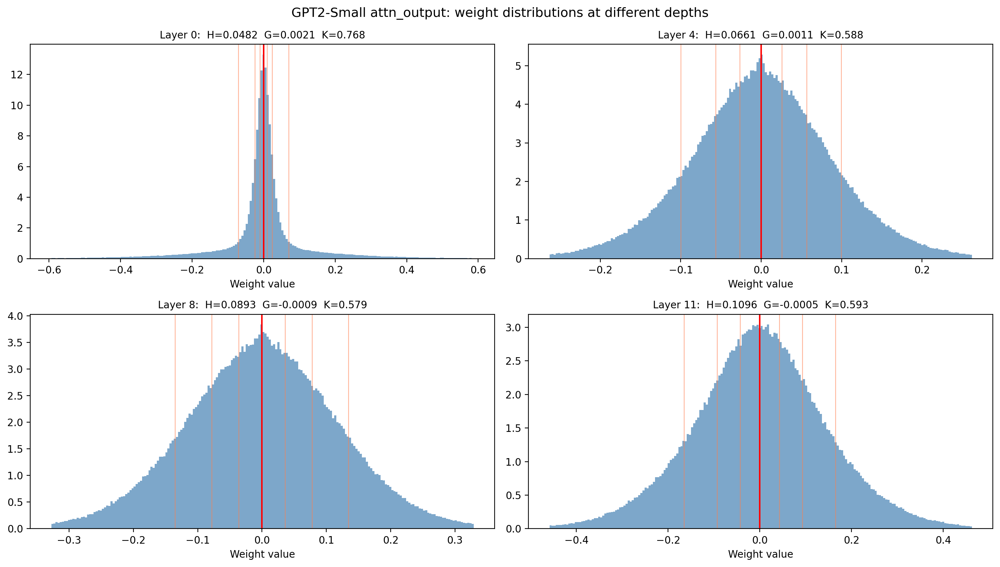 |  |
| **Fig. 12** — Weight histograms by layer (GPT-2 Small `attn_output`) | **Fig. 15** — Exact / C-Trapezoid / Midpoint overlay |
| 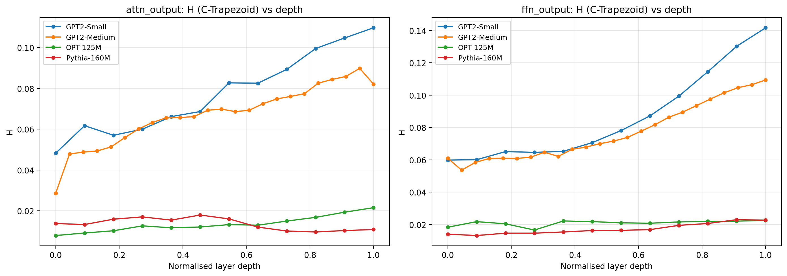 | 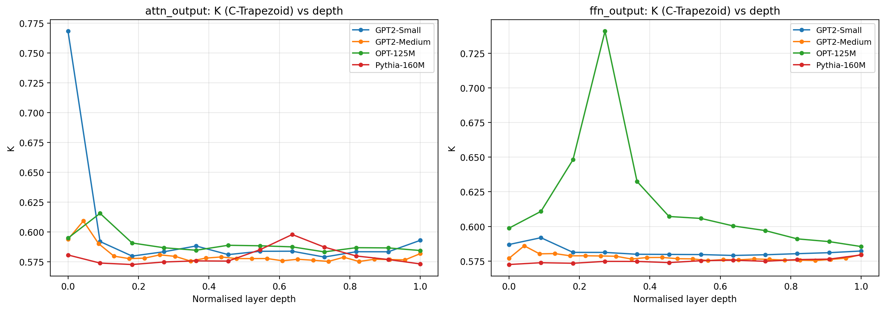 |
| **Fig. 16** — $H$ spread vs. layer depth, all models | **Fig. 17** — $K$ kurtosis vs. layer depth |
|  | 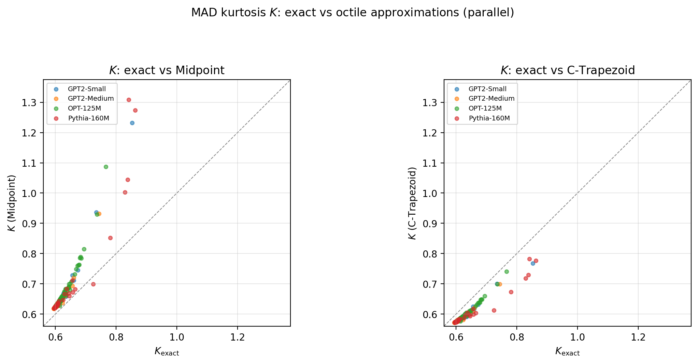 |
| **Fig. 13** — Exact vs. C-Trap/Midpoint scatter ($H$) | **Fig. 14** — Exact vs. C-Trap/Midpoint scatter ($K$) |
| 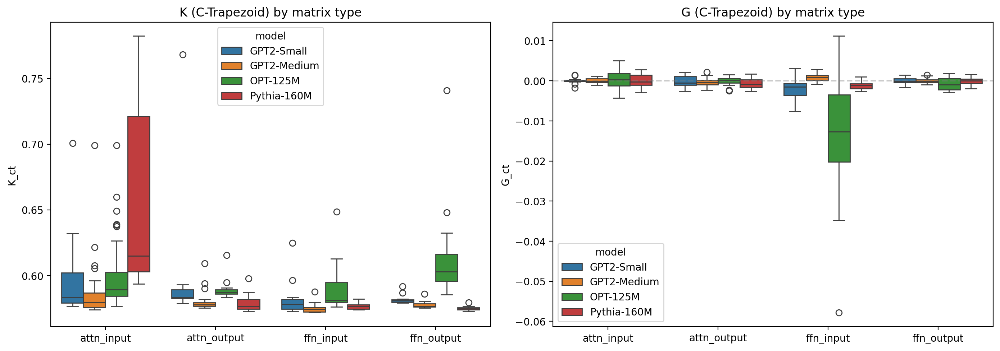 |  |
| **Fig. 18** — $H$, $G$, $K$ boxplots across matrix types | **Fig. 20** — Cross-family comparison (12-layer models) |
|  | |
| **Fig. 19** — GPT-2 Small vs. Medium scaling | |

---

## Setup and Reproduction

```bash
git clone https://github.com/anacodicAI-labs/c-trapezoid-quantile-metrics.git
cd c-trapezoid-quantile-metrics
pip install -r requirements.txt
```

**Case Study I (XLK):**
```bash
jupyter lab
# Open: case_study_stock/jupiter_notebooks/
#        simple_h_approximation_comparisons_11_17_2025.ipynb
```

**Case Study II (LLM) — Notebooks:**
```bash
jupyter lab
# Run in order:
# 1. case_study_llm/nb1-ctrapezoid/nb1_ctrapezoid.ipynb
# 2. case_study_llm/nb2-exact/nb2_exact.ipynb
# 3. case_study_llm/nb3-comparison/nb3_comparison.ipynb
```
Model weights (~2 GB) download automatically from Hugging Face on first run and are cached in `~/.cache/huggingface/`.

**Case Study II (LLM) — Standalone Scripts:**
```bash
cd jupiter_notebooks/scripts
python llm_dataset_summary.py     # Table 26 statistics
python llm_weight_acf.py          # Table 27 autocorrelations
python wall_clock_mle_vs_closed_form.py   # Table 9 timing benchmark
```

---

## Paper–Repository Cross-Reference

| Paper element | Repository path |
|---|---|
| Table 9 — wall-clock timing | `jupiter_notebooks/scripts/wall_clock_mle_vs_closed_form.py` + `.csv` |
| Table 26 — LLM dataset summary | `jupiter_notebooks/scripts/llm_dataset_summary.py` + `.csv` |
| Table 27 — weight ACF | `jupiter_notebooks/scripts/llm_weight_acf.py` + `.csv` |
| Figures 12–20 — LLM case study | `figures_llm/` |
| Figures 4–9 — XLK case study | `case_study_stock/` |
| Case Study I analysis | `case_study_stock/jupiter_notebooks/` |
| Case Study II analysis | `case_study_llm/nb1-ctrapezoid/`, `nb2-exact/`, `nb3-comparison/` |
| Method comparison across distributions | `comparison_approximations.ipynb` |

---

## Requirements

```
numpy>=1.24
scipy>=1.10
pandas>=2.0
matplotlib>=3.7
seaborn>=0.12
jupyter>=1.0
ipython>=8.0
transformers>=4.35
torch>=2.0
safetensors>=0.4
```

---

## Citation

```bibtex
@article{pinsky2026mad,
  title   = {Elementary and Robust Distribution Shape Analysis via Mean Absolute
             Deviations and Quantile-Based Quadrature Approximations},
  author  = {Pinsky, Eugene and Kundu, Triparna and Kaur, Rashanjot},
  journal = {Journal of Experimental and Theoretical Analyses},
  year    = {2026}
}
```

---

## Authors

**Eugene Pinsky, Triparna Kundu, Rashanjot Kaur**
Department of Computer Science, Boston University

*Repository: https://github.com/anacodicAI-labs/c-trapezoid-quantile-metrics*
